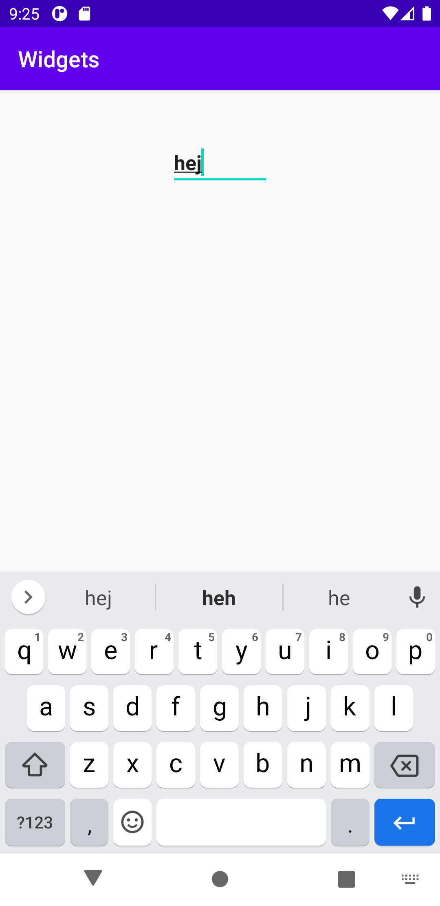
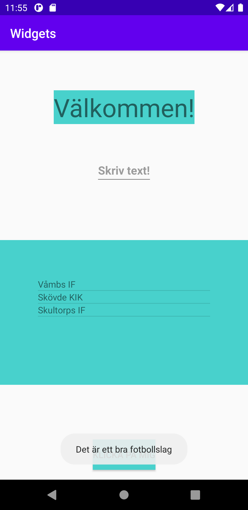
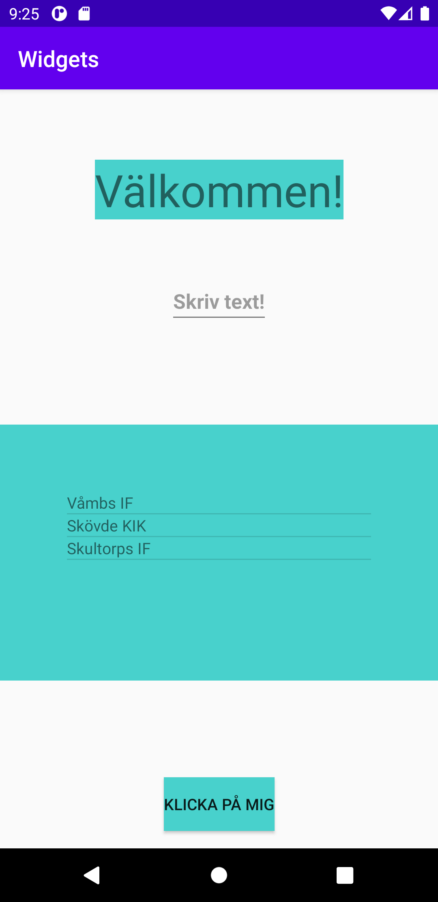

# Assignment 3
## Constraint layout
I constraint layout är vyerna utformade i förhållande med syskonvyerna samt överordning layout. I activity_main.xml filen anges det längst upp samt längst ner i filen constraint layout. För att kunna sätta vyns placering i constraint layout är man tvungen att implementera minst en horisontell samt en vertikal begränsning. Vyn måste alltså ha minst en begränsning för alla axlar men oftast är det bäst att ha flera. 	För att vyn ska ta upp hela skärmens bredd och höjd anges det layout-width: “match_parent” samt layout-height: “match_parent”. Match_parent anger att den ska matcha dimensionen med föräldern.

```
    <?xml version="1.0" encoding="utf-8"?>
    <androidx.constraintlayout.widget.ConstraintLayout
    xmlns:android="http://schemas.android.com/apk/res/android"
    xmlns:app="http://schemas.android.com/apk/res-auto"
    xmlns:tools="http://schemas.android.com/tools"
    android:layout_width="match_parent"
    android:layout_height="match_parent"
    tools:context=".MainActivity">
    ...
    </androidx.constraintlayout.widget.ConstraintLayout>
```

## Edittext
Edittext är en funktion som låter användaren göra en textinmatning. För att börja skapa edittext skrivs Edittext in i activity_main-xml filen därefter väljs det ut vilken storlek som edittext ska ha. Den storleken som valdes var wrap-content som är en förinställd storlek som enbart använder den storleken som innehållet behöver. Anledningen till att det valdes var för att få en mer tydlig och enkel känsla vid utseendet av appen. Om en annan förinställd storlek skulle vald såsom match_parent hade hela raden tagits upp av elementet. För att kunna komma åt edittext i java koden angavs det ett id. Edittext fick id:et **edit_text**. Edittext har även fyra rader kod som styr edittext elementets placeringen. Samtliga fyra rader kod är satta till parent, detta betyder att edittext kommer att placeras i mitten av skärmen. För att ställa in en textrad som visas i Edittext och som försvinner när användaren interagerar med den användes attribut **android:hint**. De orden som sattes var skriv text! För att skapa lite styling på edittext användes det en margin_bottom för att placera elementet i rätt höjd samt textstyle=bold som talar om att texten skriv text ska vara i fetstil.

```
    <EditText
    android:id="@+id/edit_text"
    android:hint="@string/skriv_text"
    android:layout_width="wrap_content"
    android:layout_height="wrap_content"
    app:layout_constraintBottom_toBottomOf="parent"
    app:layout_constraintLeft_toLeftOf="parent"
    app:layout_constraintRight_toRightOf="parent"
    app:layout_constraintTop_toTopOf="parent"
    android:layout_marginBottom="300dp"
    android:textStyle="bold"/>
```
### Edittext utseende i appen


## Button
Det första som lades till i button funktionen var en heigh och width som talar om hur hög och bred knappen ska vara. Det som valdes var wrap-content på grund av att knappen ska anpassa sig efter sin storlek. För att komma åt knappen i java koden angavs det också ett id som fick namnet button. För att knappen också ska vara utformad med en text angavs det attributet text med texten **klicka på mig**. Samma fyra kodrader som för edittext angavs också för button för att placera knappen i mitten. Valde också att styla knappen med en blå färg som matchar resten av appen, samt en margin top för att placera den i rätt höjd.

```
    <Button
    android:id="@+id/button"
    android:text="@string/klicka_p_mig"
    android:layout_width="wrap_content"
    android:layout_height="wrap_content"
    app:layout_constraintBottom_toBottomOf="parent"
    app:layout_constraintLeft_toLeftOf="parent"
    app:layout_constraintRight_toRightOf="parent"
    app:layout_constraintTop_toTopOf="parent"
    android:layout_marginTop="600dp"
    android:background="#48D1CC"/>
```

För att komma åt knappen ifrån javakoden användes metoden **findViewById()** som lades in i main_activity filen i metoden **OnCreate()**.

```
    Button my_button = findViewById(R.id.button);
```

Det importerades också en klass för knappen längst upp i main_activity.java. Detta på grund av att Android skriver ut ett rött understreck under button på activity-main.xml som att det är något fel på knappen. Detta försvinner om klassen importeras.

```
    import android.widget.Button;
```

För att kunna göra något med knappen när man klickar på den lades det in en klicklistare. Som med hjälp av det skapade id:et hittar button i xml filen. I LogCat kommer det upp att man har interagerat med knappen. Klicklistaren lades även den in i **OnCreate()** metoden.

```
    my_button.setOnClickListener(new View.OnClickListener() {
    @Override
    public void onClick(View view) {
        Log.d("==>","Klickade på skicka!");
    }
    });
```


På grund av att det skapas röda linjer under Log importerades det en till klass.
```
    import android.util.Log;
```

## Listview
Listview skapades genom att använda XML filen samt java kod. Det första som gjordes var att skapa en ny xml fil som fick namnet **list_textview.xml**. Vid skapandet av filen valdes det också textview i root elementet av layout filen. I koden valdes det en height och width med den förinställda storleken match_parent för att få listviewn över hela skärmen. Det valdes även ett id som fick namnet **list_textview.xml**.

```
    <TextView
    xmlns:android="http://schemas.android.com/apk/res/android"
    android:layout_width="match_parent"
    android:layout_height="match_parent"
    android:id="@+id/list_textview.xml">
    </TextView>
```

Det måste också implementeras en listview i activity_main.xml filen vilket gjordes med samma height och width som i list_textview.xml. Det angavs också ett id vilket blev **list_textview** för att kunna använda i java koden. Stylingen som gjordes var att lägga in en blå färg som bakgrund, en padding för att listan att flyttas in samt en margin top och margin bottom på grund av att det användes match_parent som fyller hela skärmen.

```
    <ListView
    android:id="@+id/list_textview"
    android:layout_width="match_parent"
    android:layout_height="match_parent"
    android:layout_marginTop="300dp"
    android:layout_marginBottom="150dp"
    android:background="#48D1CC"
    android:padding="60dp">
    </ListView>
```


För att kunna fylla listviewn med objekt behövs en arrayadapter som tar emot rådatan och gör om datan till objekt som sedan kan visas i listviewn. För att skapa rådata skapades det en string med ett namn. Efter det skapas en arraylista av rådatan. För att arraylist ska veta vad den ska lagra anges namnet ifrån stringen i aslist.
```
    private String[] fotbollslagsnamn = {"Våmbs IF","Skövde KIK","Skultorps IF"};
    private ArrayList<String> listData=new ArrayList<>(Arrays.asList(fotbollslagsnamn));
```

Sedan skapas arrayadaptern genom att ange arrayadapter `string` och namnet adapter. Efter det anslutes layoutfilen **list_textview** med textview elementet **list_textview_xml** samt arraylist **listdata**.

```
    ArrayAdapter<String> adapter=new ArrayAdapter<String>(this,R.layout.list_textview,R.id.list_textview_xml,listData);
```

För att ge en referens till listviewn används **findviewById** metoden.

```
    ListView listView=(ListView) findViewById(R.id.list_textview);
```

Ansluter sedan arrayadapter till listviewn med hjälp av variabeln **listView** samt en **setadapter**.
```
    listView.setAdapter(adapter);
```

För att kunna interagera med listviewn skapades det en klicklistner genom att ange variabeln **listView**. Sedan används en **setonitemclicklistener** som hämtar det värdet som är satt ska hända när man klickar på listviewn vilket är att det ska skickas ett toastmeddelande med texten **Det är ett bra fotbollslag**. OnItemcklick är en callback metod som återropas när ett objekt har klickats på. AdapterView är det som kommer att visas ifrån adaptern.

```
    listView.setOnItemClickListener(new AdapterView.OnItemClickListener() {
            @Override
            public void onItemClick(AdapterView<?> parent, View view, int position, long id) {
                Toast.makeText(getApplicationContext(), "Det är ett bra fotbollslag!", Toast.LENGTH_SHORT).show();
            }
        });
```
### Toastmeddelandet när användaren klickar på listview


### Hela appens utseende med alla funktioner



